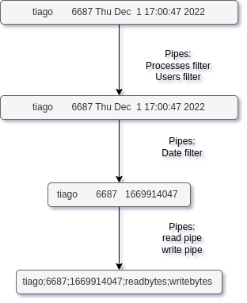

# Taxas de Leitura/Escrita de processos em bash

---

---

### Introdução

Neste trabalho temos como objetivo desenvolver um script que dará ao seu utilizador informação sobre a escrita e leitura dos vários processos ativos no sistema.

```
COMM     USER    PID    READB    WRITEB    RATER    RATEW           DATE

nice     tigo     69    77777      6666       42      100   Sep 12 11:45
lit      nlau    420      777     66666       21      200   Sep 19 08:49
nbeast    idk    666     7777         6       12      300   Sep 19 08:49
```

A utilização regular deste script pode ser realizada através do seguinte formato:

```bash
./rwstat.sh t
```

sendo **t** um inteiro, que corresponde ao número de segundos para o qual será analisada a escrita e leitura dos processos demonstrados na saída.

Também podemos filtrar a informação que nos é dada através de várias flags:

#### -c /regex/

    Com esta **flag** serão entregues todos os processos cujo nome encontrado em `/proc/pid/comm` corresponda/combine com o regex dado.

**Ex:**

```bash
./rwstat.sh -c "Hypr*" 5
```

#### -s **start_date**  -e **ending_date**

    Se quisermos obter todos os processos iniciados a partir de uma determinada data ou antes de uma outra, ou até mesmo num determinado intervalo de tempo, podemos utilizar as flags acima, -s, para definir uma data de começo, -e, para definir uma data limite.

**Ex:**

```bash
./rwstat.sh -s "01-12-22" -e "Sep 10 10:00" 5
```

#### -u **/regex/**

    Com esta **flag** serão entregues todos os processos cujo nome do utilizador corresponda/combine com o regex dado.

**Ex:**

```bash
./rwstat.sh -u "^tia" 5
```

#### -m **min_pid** -M **max_pid**

    Estas opções dão-nos a possibilidade de obter todos os processos iniciados a partir de um pid ou antes de um outro, ou até mesmo todos os processos num determinado intervalo de pids utilizando as flags acima, -m, para definir um pid mínimo, -M, para definir um pid máximo.

**Ex:**

```bash
./rwstat.sh -m 1 -M 600 5
```

#### -p **n_proc**

 A flag -p define o número de processos a ser mostrados na saída. Em omissão o seu valor será 4. 

**Ex:**

```bash
./rwstat.sh -p 30 5
```

#### -r -w

 Sem a referência destas flags, os resultados são ordenados crescentemente pela ordem de leitura, no entanto podemos mudar esta ordem para usar os dados de escrita com a flag -w, inverter a ordem com -r, ou ambas.

**Ex:**

```bash
./rwstat.sh -r -w 5
```

---

### Resolução

**Organização**

Para o desenvolvimento desta ferramenta, começamos por testar como as opções eram recebidas e como fazer os asserts necessários. Seguidamente, trabalhamos em como recolher os dados e finalmente em aplicar as opções, pelo que podemos dividir a resolução deste trabalho em 3 secções: <u>Sanitização de argumentos e opções</u>, <u>Recolha e processamento de dados</u>, <u>Aplicação das opções</u>.

Apesar de conseguirmos ver relativamente bem estas secções no script, não há qualquer compartimentação das mesmas, pelo que por exemplo parte da aplicação das opções está na recolha de dados para evitar o processamento de dados não pedidos pelo utilizador.

**Sanitização de argumentos e opções**

Ao correr o script, a primeira coisa que verificamos é o numero de argumentos e o argumento do tempo.

<u>Número de argumentos</u>

Se o número de argumentos for menor que 0, alertamos o utilizador que falta pelo menos o parâmetro obrigatório do tempo.

```bash
n_arg=$#
if [ $n_arg -le 0 ]; then
    echo "Parâmetro obrigatório em falta (Tempo em segundos )"
    exit $E_ASSERT_FAILED
fi
```

<u>Tempo</u>

Ver depois se é um inteiro, se um destes critérios não for seguidos imprimimos um alerta e paramos a execução.

```bash
n_arg=$#
time=${@: -1}
re='^[0-9]+$'


if [ $n_arg -le 0 ]; then
    echo "Parâmetro obrigatório em falta (Tempo em segundos )"
    exit $E_ASSERT_FAILED
fi


if ! [[ $time =~ $re ]] ; then
    echo "O ultimo argumento tem de ser o tempo"
    exit $E_ASSERT_FAILED
fi

...
```

Após a verificação inicial do argumento do tempo e do número de argumentos, processamos todas as opções com o `getopts`, e verificamos, caso presentes, se as datas iniciais, finais ou ambas, são validas para passar como argumento para o comando `date` , que utilizamos para obter a unix timestamp da data. Caso não sejam, alertarmos o utilizador.

<u>Datas</u>

Para verificarmos se realmente as datas são validas, corremos o comando supondo que são, limpamos o **stderr**,`2>:`, e o **stdout**,`1>:`, e damos "`echo`" do código de saída. Caso seja um damos um alerta ao utilizador.

```bash
...
s) ou e)
  if [ $(date -d "$OPTARG" 2>: 1>:; echo $?) == 1 ]; then
     echo "Data inicial invalida"
     exit $E_ASSERT_FAILED
  fi
  date=$(date -d "$OPTARG" "+%s")
;;
...
```

Depois de validarmos as datas, se existirem, vamos verificar, assim como no tempo, se o utilizador ativou as flags do **PID** mínimo,**PID** maximo ou ambas e confirmamos que são inteiros.

<u>Limites PID</u>

Nada de especial, simplesmente o que fizemos para o tempo.

```bash
 m) ou M)
  if ! [[ $OPTARG =~ $re ]]; then # se o argumento final não for um numero o programa não corre
        echo "PID lim tem de ser um inteiro"
        exit $E_ASSERT_FAILED
  fi
  lim=$OPTARG
 ;;
```

**Recolha e processamento de dados/Aplicação das opções**

Foi aqui que chegamos à conclusão, se já não era claro, de que **awk** é um poderoso processador de texto, ao ponto de, através de pipes e do mesmo, conseguimos numa única linha obter todos os dados inicias necessários, algo ao que chamei de **linha sagrada**.

```bash
data=( $(ps -eo euser,pid,lstart | tail -n +2 \
| awk '{"if [[ -f /proc/"$2"/comm ]]; then cat /proc/"$2"/comm ; fi" | getline proc_name; close(proc_name); regex="'$proc_reg'"; if ( (proc_name ~ regex) ){print $0 } }' \
| awk '$1 ~ "'$user_reg'" {print $0}' \
| awk '{date=$3" "$4" "$5" "$6" "$7; "date -d \"" date "\" " "\"+%s\"" | getline timestp; if( timestp > '$min_date' && timestp < '$max_date'){ print $2,$1,timestp }}' \
| awk '{ if( $1 > '$min_PID' && $1 < '$max_PID' ){ print $0 }}' \
| awk '{"if [[ -r /proc/"$1"/io ]]; then cat /proc/"$1"/io | sed -n 1p | cut -d \" \" -f2; fi" | getline read; print $1,$2,$3,read}' \
| awk '{"if [[ -r /proc/"$1"/io ]]; then cat /proc/"$1"/io | sed -n 2p | cut -d \" \" -f2; fi" | getline write; print $1":"$2":"$3":"$4":"write}') )
```

<u>Dissecação da linha sagrada</u>

```bash
ps -eo euser,pid,lstart
```

Aqui obtemos todas as colunas significativas para o nosso script que o `ps` nos pode dar: o `user`,`pid` e `start_time`, podíamos também obter o nome do processo, no entanto em alguns processos iriam ocorrer problemas devido a espaços aleatórios que impediam o `awk`de apanhar nome e sim apenas parte dele, sem mencionar que nos é estritamente indicado no guião para irmos buscar esta informação a `proc/pid/comm`.

```bash
| awk '{"if [[ -f /proc/"2"/comm ]]; then cat /proc/"$2"/comm ; fi" | getline proc_name; close(proc_name); regex="'proc_reg'"; if ( (proc_name ~ regex) ){print $0 } }
```

Dando pipe da instrução acima, utilizamos a **bash** dentro de **awk** para obtermos o nome do processo com o **PID** capturado no segundo campo, `$2`, de cada linha, verificamos se existe `if [[ -f ...`, e passamo-lo para o argumento de **awk** `proc_name`, vendo se combina com o regex submetido pelo utilizador, ou por omissão `"."`, que nos dá todas as entradas, `$proc_reg`, se sim imprimimos a linha toda.

```bash
| awk '1 ~ "'$user_reg'" {print $0}'
```

Agora, novamente recebendo pipe da linha acima, agora já com os processos desejados, fazemos algo parecido com o nome do processo que retiramos, mas desta vez não necessitamos de usar bash pois conseguimos retirar o nome do utilizador para comparar logo a partir do primeiro campo. Assim como no regex para os processos este é `"."` caso o utilizador não especifique nenhum, imprime todas as entradas.

```bash
| awk '{date=$3" "$4" "$5" "$6" "$7; "date -d \"" date "\" " "\"+%s\"" | getline timestp; if( timestp > '$min_date' && timestp < '$max_date'){ print $2,$1,timestp }}'
```

Para conseguirmos facilmente comparar os tempos dados pelo utilizador, utilizamos novamente **bash** para usar o comando `date` dentro de **awk** e fornecendo os campos necessários.

Obtendo as datas em unix time comparamo-las com as mínimas e máximas, já em **awk** , por omissão a data mínima é -1, não existem processos antes 1970, em princípio, e a máxima é o tempo a que a execução começou mais 2 horas, depois imprimindo o `pid`,`user`,`start_time` dos processos que cumprem a condição.

Esta é secção que demora mais a ser feita.

```bash
| awk '{ if( 1 > '$min_PID' && 1 < '$max_PID' ){ print $0 }}'
```

Agora com os processos filtrados por **user**, **process_name**, **start_time** processamos os resultado recebidos do pipe, semelhante a exemplos anteriores, pelo seu **pid**, definido ou não, por omissão o pid máximo é dado `/proc/sys/kernel/pid_max`,que nos da o numero máximo de pids do sistema, e o pid mínimo é  -1 pois não existem pids negativos. 

```bash
| awk '{"if [[ -r /proc/"$1"/io ]]; then cat /proc/"$1"/io | sed -n 1p | cut -d " " -f2; fi" | getline read; print 1,2,$3,read}' \
```

Nesta e na próxima linha simplesmente verificamos se o ficheiro com o pid do campo um existe e se existir retiramos os campo `read_char` e na linha seguinte `write_char`para anexar entrada com as informações do processo.

```bash
| awk '{"if [[ -r /proc/"1"/io ]]; then cat /proc/"1"/io | sed -n 2p | cut -d " " -f2; fi" | getline write; print 1":"2":"3":"4":"write}') )
```

A única diferença desta linha para a anterior é que como dito adicionamos o valor de `write_char` e formatamos a informação para um mais fácil acesso e passarmos a informação para um array.

```bash
data=( $(...) )
```

Aqui simplesmente passamos a informação das operações executadas dentro do parêntesis para um array. Podemos a fluxo de informação ao longo desta linha através deste diagrama.





<u>Formação do output</u>

Após a "linha sagrada" e a espera do tempo introduzido pelo utilizador, não fazemos nada demais senão recolher a informação do array, descobrir o `read_atual` e `write_atual` dos processos que ainda existem e calcular o  **read**,**write**, e os respectivos **rates**, tudo num ciclo numa agregação de código que dá pipe ao comando `sort` com opções definidas acima.
Primeiramente, recorremos ao comando cut para selecionar as colunas do nosso elemento do array que queremos guardar em cada varíavel, definindo o separador como sendo ":". Para o id, vamos buscar a primeira coluna do array, para a data, a terceira coluna e para o user a segunda. A partir do id, vamos também buscar o nome do processo ao ficheiro "comm". Resta apenas calcular os readbytes, writebytes e a respetiva taxa de leitura e escrita. Para calcular os readbytes, vamos buscar os readbytes iniciais ao nosso array e os readbytes finais ao ficheiro io correspondente ao id que queremos, e subtraimos ao final o inicial. Para os writebytes, a lógica é a mesma mas damos cut à quinta coluna da entry. Para obter os rates, basta dividir os bytes lidos e escritos pelo tempo decorrido.

```bash
{

  for entry in ${data[@]}; do

    id=$( echo $entry | cut -d ":" -f1 )

    if [[ -r /proc/$id/io ]];then

        i_rw=$( echo $entry | cut -d ":" -f4 )

        # Get date

        d=$( echo $entry | cut -d ":" -f3 )
        d=$(date -d @$d)

        # Get User

        user=$( echo $entry | cut -d ":" -f2 )

        # Get process

        process=$( cat /proc/"$id"/comm )

        # Calculate Readbytes
        i_rw=$( echo $entry | cut -d ":" -f4 )
        f_rw=$( cat /proc/$id/io | sed -n 1p | cut -d " " -f2 )
        read=$(($f_rw-$i_rw))

        # Calculate Writebytes
        i_rw=$( echo $entry | cut -d ":" -f5 )
        f_rw=$( cat /proc/$id/io | sed -n 2p | cut -d " " -f2 )
        write=$(($f_rw-$i_rw))

        # Calculate RateR

        rr=$( bc <<< "scale=2; $read / $time" )

        # Calculate RateW

        rw=$( bc <<< "scale=2; $write / $time" )

        printf "%-10s\t%10s\t%10s\t%10s\t%10s\t%10s\t%10s\t%10s\n" "$process" "$user" "$id" "$read B" "$write B" "$rr B/s" "$rw B/s" "$d"

    fi
  done

} | sort $order_of_sort |sed -n "1,$p p"
```

Para acedermos ao campo n de uma entrada do array podemos faze-lo 

```bash
var=$( echo $entry | cut -d ":" -fn )
```


---

### Bibliografia

[max_pid]([c - Maximum PID in Linux - Stack Overflow](https://stackoverflow.com/questions/6294133/maximum-pid-in-linux))

[ps man page]([ps(1): report snapshot of current processes - Linux man page](https://linux.die.net/man/1/ps))

[awk](https://www.gnu.org/software/gawk/manual/gawk.pdf)
